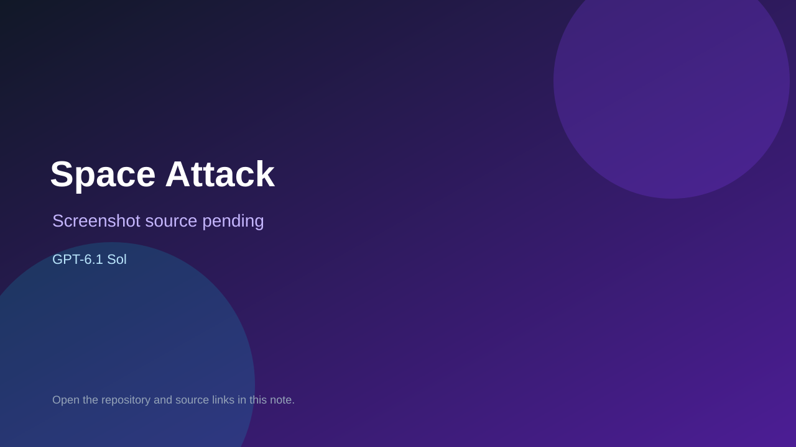

# Space Attack

> Top-list entry: **today** (#3), **this month** (#6).

## At a glance

- **Score:** 7.8/10
- **Model:** GPT-6.1 Sol
- **Technology:** HTML, JavaScript, Canvas 2D, Web Audio, Browser
- **Estimated FP32 operations/s at 60 FPS:** 250,000,000 (low confidence; static estimate, not measured).
- **Rating basis:** Source and creator report document a complete shooter loop with waves, enemies, pickups, bosses, audio and iterative play-driven refinement; no independent playtest.
- **Verified:** 2026-10-04
- **Repository:** [https://github.com/vannorman/space_attack](https://github.com/vannorman/space_attack)
- **Evidence:** [creator-reported model evidence](https://github.com/vannorman/space_attack/blob/main/README.md)
- **Live demo:** [open demo](https://vannorman.github.io/space_attack/)

## Screenshots

No screenshot source is recorded yet. Keep the placeholder until a repository, awesome list, or creator source provides an image.

## Model attribution

Open the evidence link above. Evidence grade: **creator-reported model evidence**.

## Source description

The creator’s README explicitly reports building the game with Codex GPT-6.1 Sol Light, and says all assets, code and game logic were created with AI from prompts. It links a live canvas shooter with waves, weapons, upgrades and bosses; the demo returned HTTP 200. Keep GPT-6.1 Sol distinct from GPT-6 Astra. No independent full playthrough was performed.

### Gameplay source

- [https://github.com/vannorman/space_attack/blob/main/index.html](https://github.com/vannorman/space_attack/blob/main/index.html)
- [https://github.com/vannorman/space_attack/blob/main/README.md](https://github.com/vannorman/space_attack/blob/main/README.md)

## Verification notes

- **Status:** verified_source
- **Counted units in repository:** 1
- **Units covered by this note:** 1
- **Discovery:** GitHub repository search: GPT-6.1 Sol game created 2026-10-03 (Asia/Ho_Chi_Minh); https://github.com/vannorman/space_attack; https://github.com/vannorman/space_attack/blob/main/README.md

[Back to the awesome list](../../README.md)
