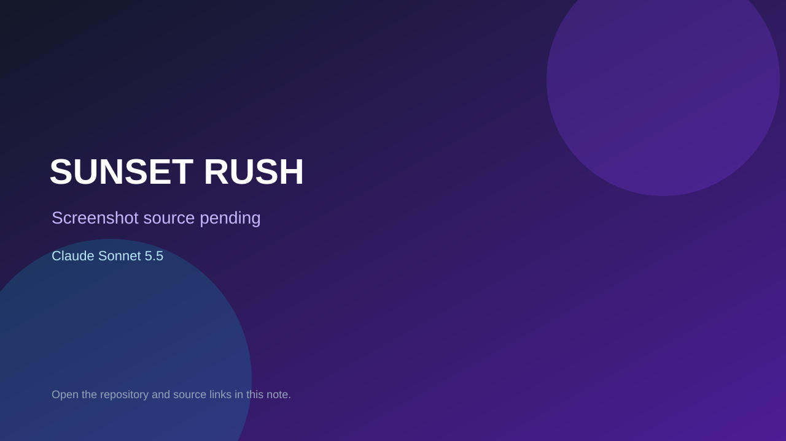

# SUNSET RUSH

> Verified game note.

## At a glance

- **Score:** 8.5/10
- **Model:** Claude Sonnet 5.5
- **Technology:** JavaScript, Canvas 2D, Web Audio
- **Estimated FP32 operations/s at 60 FPS:** 12,000,000 (low confidence; static estimate, not measured).
- **Rating basis:** Estimate source completeness, mechanics, documented run path, tests and attribution; do not treat this as a visual review or runtime benchmark.
- **Verified:** 2026-09-30
- **Repository:** [https://github.com/DaikiKobayashi/sonnet-5-5-web-game-samples](https://github.com/DaikiKobayashi/sonnet-5-5-web-game-samples)
- **Evidence:** [creator-reported model evidence](https://github.com/DaikiKobayashi/sonnet-5-5-web-game-samples/blob/29197247452de992b69b161bf258f02b2ab9ada5/README.md)
- **Live demo:** [open demo](https://daikikobayashi.github.io/sonnet-5-5-web-game-samples/games/sunset-rush/max/)

## Screenshots

No screenshot source is recorded yet. Keep the placeholder until a repository, awesome list, or creator source provides an image.

## Model attribution

Open the evidence link above. Evidence grade: **creator-reported model evidence**.

## Source description

Inspect two separately scoped games: Dynamite Mole implements bombs, flame propagation, enemies, lives, five stages and exits; SUNSET RUSH implements steering, traffic, checkpoints, a timer, three stages and ending ranks. Count effort variants once per named game. Credit Sonnet 5.5 authoring; keep Opus 5.5 evaluation separate. Inspect the checked-in entry point and gameplay systems. Treat repository creation as a freshness proxy, not proof of game creation or publication. Do not treat this source verification as a runtime playtest.

### Gameplay source

- [https://github.com/DaikiKobayashi/sonnet-5-5-web-game-samples/blob/29197247452de992b69b161bf258f02b2ab9ada5/games/sunset-rush/impl/max/dist/js/sim.js](https://github.com/DaikiKobayashi/sonnet-5-5-web-game-samples/blob/29197247452de992b69b161bf258f02b2ab9ada5/games/sunset-rush/impl/max/dist/js/sim.js)
- [https://github.com/DaikiKobayashi/sonnet-5-5-web-game-samples/blob/29197247452de992b69b161bf258f02b2ab9ada5/README.md](https://github.com/DaikiKobayashi/sonnet-5-5-web-game-samples/blob/29197247452de992b69b161bf258f02b2ab9ada5/README.md)

## Verification notes

- **Status:** verified_source
- **Counted units in repository:** 2
- **Units covered by this note:** 1
- **Discovery:** GitHub model-and-date repository search; commit-attribution freshness join (September 29–30 UTC+7); https://github.com/DaikiKobayashi/sonnet-5-5-web-game-samples

[Back to the awesome list](../../README.md)
