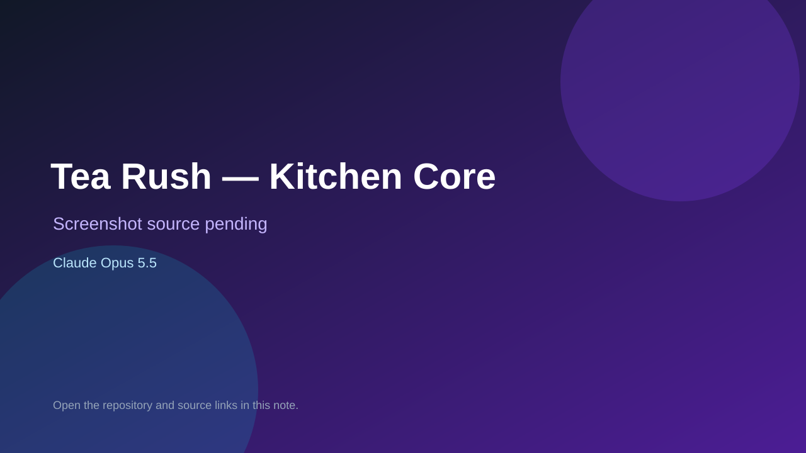

# Tea Rush — Kitchen Core

> Verified game note.

## At a glance

- **Score:** 7.0/10
- **Model:** Claude Opus 5.5
- **Technology:** Godot 4, GDScript, Native desktop
- **Estimated FP32 operations/s at 60 FPS:** 1,000,000,000 (low confidence; static estimate, not measured).
- **Rating basis:** Conservative source-scope estimate from implemented controls, rules and state; not a visual rating or runtime playtest.
- **Verified:** 2026-09-27
- **Repository:** [https://github.com/kpkrr/tea-game](https://github.com/kpkrr/tea-game)
- **Evidence:** [direct model evidence](https://github.com/kpkrr/tea-game/commit/4bbcb7d65e7b88c5a053f2e38b6a7ef713369b79)

## Screenshots

No screenshot source is recorded yet. Keep the placeholder until a repository, awesome list, or creator source provides an image.

## Model attribution

Open the evidence link above. Evidence grade: **direct model evidence**.

## Source description

Tap kitchen stations to prepare multistep tea orders, manage brewing timers and customer patience, and lose after three customers leave. Count only the implemented kitchen-core prototype, not the bundled agent templates. Verify source only; do not infer runtime success or publication date from repository creation.

### Gameplay source

- [https://github.com/kpkrr/tea-game/blob/ce39a996e740ec8d72f17a8873c6c9bf5b7c9239/prototypes/kitchen-core/kitchen_core.gd](https://github.com/kpkrr/tea-game/blob/ce39a996e740ec8d72f17a8873c6c9bf5b7c9239/prototypes/kitchen-core/kitchen_core.gd)
- [https://github.com/kpkrr/tea-game/commit/4bbcb7d65e7b88c5a053f2e38b6a7ef713369b79](https://github.com/kpkrr/tea-game/commit/4bbcb7d65e7b88c5a053f2e38b6a7ef713369b79)

## Verification notes

- **Status:** verified_source
- **Counted units in repository:** 1
- **Units covered by this note:** 1
- **Discovery:** GitHub repository search: model/game created:2026-09-25..2026-09-27; exact creation timestamp filtered to Asia/Ho_Chi_Minh September 26–27; https://github.com/kpkrr/tea-game

[Back to the awesome list](../../README.md)
