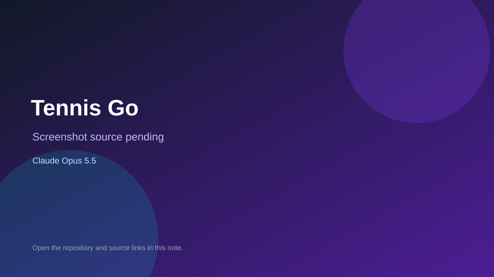

# Tennis Go

> Top-list entry: **today** (#6), **this week** (#8), **this month** (#8).

## At a glance

- **Score:** 8.2/10
- **Model:** Claude Opus 5.5
- **Technology:** HTML, JavaScript, Browser
- **Estimated FP32 operations/s at 60 FPS:** 600,000,000 (low confidence; static estimate, not measured).
- **Rating basis:** Full career systems in one line of builds; no playtest.
- **Verified:** 2026-10-07
- **Repository:** [https://github.com/hartwigcam98-star/Tennis-go](https://github.com/hartwigcam98-star/Tennis-go)
- **Evidence:** [direct model evidence](https://github.com/hartwigcam98-star/Tennis-go/commit/841acbdadc8f26ace95519e3fbbb99cc28e6024a)

## Screenshots

No screenshot source is recorded yet. Keep the placeholder until a repository, awesome list, or creator source provides an image.

## Model attribution

Open the evidence link above. Evidence grade: **direct model evidence**.

## Source description

Tennis career game with tournaments, rankings, rivals, sounds and ceremonies; Opus 5.5 trailers with session links.

### Gameplay source

- [https://github.com/hartwigcam98-star/Tennis-go/blob/main/index.html](https://github.com/hartwigcam98-star/Tennis-go/blob/main/index.html)
- [https://github.com/hartwigcam98-star/Tennis-go/commit/841acbdadc8f26ace95519e3fbbb99cc28e6024a](https://github.com/hartwigcam98-star/Tennis-go/commit/841acbdadc8f26ace95519e3fbbb99cc28e6024a)

## Verification notes

- **Status:** verified_source
- **Counted units in repository:** 1
- **Units covered by this note:** 1
- **Discovery:** GitHub commit pool: Opus/Sonnet game commits filtered to repos created Oct 6-7 (Asia/Ho_Chi_Minh); https://github.com/hartwigcam98-star/Tennis-go; https://github.com/hartwigcam98-star/Tennis-go/commit/841acbdadc8f26ace95519e3fbbb99cc28e6024a

[Back to the awesome list](../../README.md)
