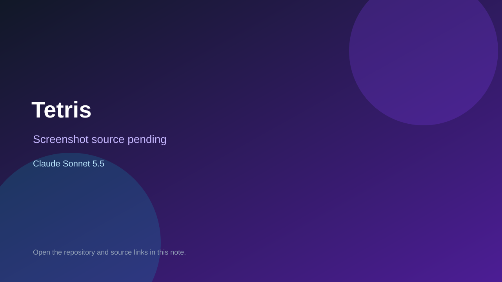

# Tetris

> Top-list entry: **this month** (#12).

## At a glance

- **Score:** 7.3/10
- **Model:** Claude Sonnet 5.5
- **Technology:** HTML, CSS, JavaScript, Browser
- **Estimated FP32 operations/s at 60 FPS:** 90,000,000 (low confidence; static estimate, not measured).
- **Rating basis:** Source includes the complete recognizable play loop, scoring, level progression and loss state in a self-contained browser file. No independent playtest performed.
- **Verified:** 2026-10-02
- **Repository:** [https://github.com/sena980909/claudecode](https://github.com/sena980909/claudecode)
- **Evidence:** [direct model evidence](https://github.com/sena980909/claudecode/commit/e65672415fc27bf150f3b225283973677d3b596d)

## Screenshots

No screenshot source is recorded yet. Keep the placeholder until a repository, awesome list, or creator source provides an image.

## Model attribution

Open the evidence link above. Evidence grade: **direct model evidence**.

## Source description

Inspect the claude/tetris-game-h0mdqm branch: its single HTML file implements a falling-block game with piece rotation, collision checks, movement/drop, line clearing, level/score tracking, pause, and game-over state. The commit adds the game and contains an exact Claude Sonnet 5.5 trailer. Count the Tetris implementation once. The game is branch/source verified; no hosted demo is documented.

### Gameplay source

- [https://github.com/sena980909/claudecode/blob/claude/tetris-game-h0mdqm/index.html](https://github.com/sena980909/claudecode/blob/claude/tetris-game-h0mdqm/index.html)
- [https://github.com/sena980909/claudecode/commit/e65672415fc27bf150f3b225283973677d3b596d](https://github.com/sena980909/claudecode/commit/e65672415fc27bf150f3b225283973677d3b596d)

## Verification notes

- **Status:** verified_source
- **Counted units in repository:** 1
- **Units covered by this note:** 1
- **Discovery:** GitHub commit search: "Claude Sonnet 5.5" game committer-date:2026-09-29..2026-10-02; https://github.com/sena980909/claudecode

[Back to the awesome list](../../README.md)
