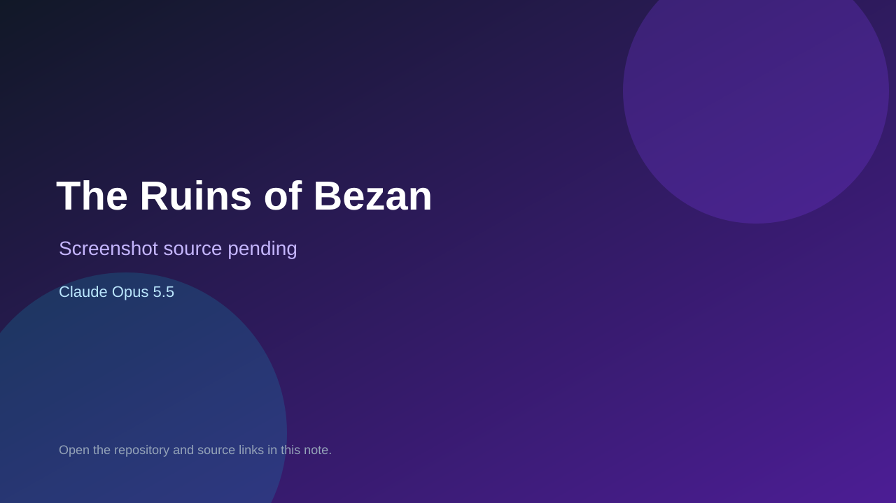

# The Ruins of Bezan

> Top-list entry: **today** (#8).

## At a glance

- **Score:** 8.1/10
- **Model:** Claude Opus 5.5
- **Technology:** C, SDL3, OpenGL, Native desktop
- **Estimated FP32 operations/s at 60 FPS:** 1,000,000,000 (low confidence; static estimate, not measured).
- **Rating basis:** Conservative source-scope estimate from documented mechanics and code; not a visual rating or runtime playtest.
- **Verified:** 2026-09-28
- **Repository:** [https://github.com/tuniveza/Generative-Games](https://github.com/tuniveza/Generative-Games)
- **Evidence:** [direct model evidence](https://github.com/tuniveza/Generative-Games/commit/89469de5d3ca351d7ecfb465578272ea9ec60ac6)

## Screenshots

No screenshot source is recorded yet. Keep the placeholder until a repository, awesome list, or creator source provides an image.

## Model attribution

Open the evidence link above. Evidence grade: **direct model evidence**.

## Source description

Explore and fight in an RPG, fish, sail, manage inventory and complete the Ember and Tide quests to return the bell for the festival. Count only the implemented The-Ruins-of-Bezan game folder, not the repository name as a catalog of multiple games. Repository creation is not proof of game publication.

### Gameplay source

- [https://github.com/tuniveza/Generative-Games/blob/831f115caeea2201fdac5315bac4fcb707eeaf85/The-Ruins-of-Bezan/main.c](https://github.com/tuniveza/Generative-Games/blob/831f115caeea2201fdac5315bac4fcb707eeaf85/The-Ruins-of-Bezan/main.c)
- [https://github.com/tuniveza/Generative-Games/commit/89469de5d3ca351d7ecfb465578272ea9ec60ac6](https://github.com/tuniveza/Generative-Games/commit/89469de5d3ca351d7ecfb465578272ea9ec60ac6)

## Verification notes

- **Status:** verified_source
- **Counted units in repository:** 1
- **Units covered by this note:** 1
- **Discovery:** GitHub model/game source search; creation filtered to 2026-09-21..2026-09-28 Asia/Ho_Chi_Minh; https://github.com/tuniveza/Generative-Games

[Back to the awesome list](../../README.md)
