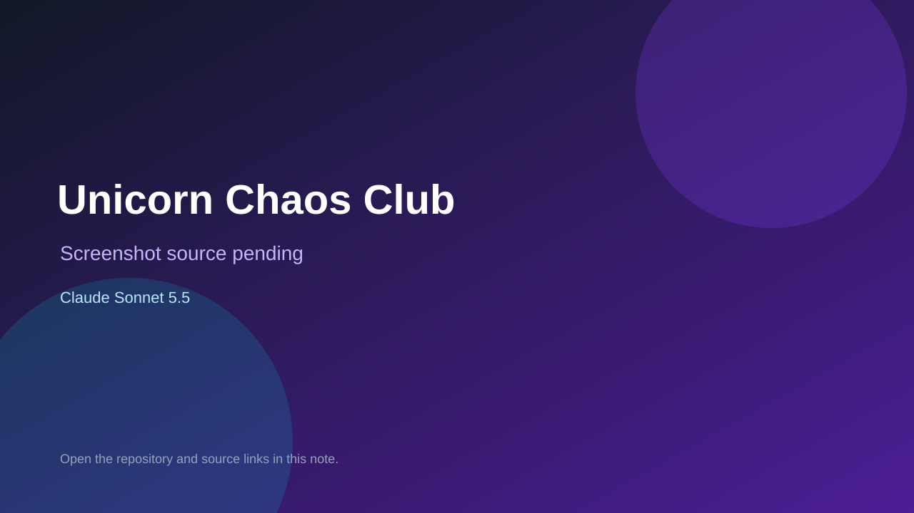

# Unicorn Chaos Club

> Verified game note.

## At a glance

- **Score:** 7.8/10
- **Model:** Claude Sonnet 5.5
- **Technology:** Preact, TypeScript, SVG, Vite
- **Estimated FP32 operations/s at 60 FPS:** 12,000,000 (low confidence; static estimate, not measured).
- **Rating basis:** Estimate source completeness, mechanics, documented run path, tests and attribution; do not treat this as a visual review or runtime benchmark.
- **Verified:** 2026-09-30
- **Repository:** [https://github.com/derHeinzer/yunicorn](https://github.com/derHeinzer/yunicorn)
- **Evidence:** [direct model evidence](https://github.com/derHeinzer/yunicorn/commit/2e37d958f9748c4cd6cf0bff1963dc9258127d0b)

## Screenshots

No screenshot source is recorded yet. Keep the placeholder until a repository, awesome list, or creator source provides an image.

## Model attribution

Open the evidence link above. Evidence grade: **direct model evidence**.

## Source description

Inspect the child-friendly prototype's rule-based color-by-number puzzles, region/number matching, page completion, sticker collection, character reactions and persistent room/album progression. Count the connected puzzle/care game once; exclude roadmap-only slime activities and future minigames. Treat repository creation as a freshness proxy, not proof of publication. Do not claim a runtime playtest.

### Gameplay source

- [https://github.com/derHeinzer/yunicorn/blob/c4e2c24ac7dd14813657639c43a106f8c276a714/src/app/main.tsx](https://github.com/derHeinzer/yunicorn/blob/c4e2c24ac7dd14813657639c43a106f8c276a714/src/app/main.tsx)
- [https://github.com/derHeinzer/yunicorn/commit/2e37d958f9748c4cd6cf0bff1963dc9258127d0b](https://github.com/derHeinzer/yunicorn/commit/2e37d958f9748c4cd6cf0bff1963dc9258127d0b)

## Verification notes

- **Status:** verified_source
- **Counted units in repository:** 1
- **Units covered by this note:** 1
- **Discovery:** GitHub commit-attribution freshness join: Claude Sonnet 5.5 game (September 29–30 UTC+7); https://github.com/derHeinzer/yunicorn

[Back to the awesome list](../../README.md)
