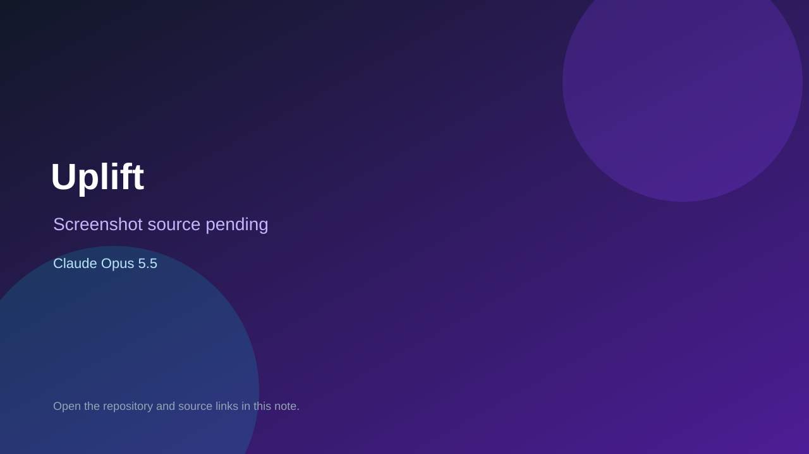

# Uplift

> Verified game note.

## At a glance

- **Score:** 7.5/10
- **Model:** Claude Opus 5.5
- **Technology:** JavaScript, WebGL, GLSL, Browser
- **Estimated FP32 operations/s at 60 FPS:** 1,000,000,000 (low confidence; static estimate, not measured).
- **Rating basis:** Conservative source-scope estimate from implemented controls, rules and state; not a visual rating or runtime playtest.
- **Verified:** 2026-09-27
- **Repository:** [https://github.com/Starwaves1/Uplift](https://github.com/Starwaves1/Uplift)
- **Evidence:** [creator-reported model evidence](https://github.com/Starwaves1/Uplift/blob/a0e40db8a08f152de1359b51c234f10bb599e5bc/README.md)

## Screenshots

No screenshot source is recorded yet. Keep the placeholder until a repository, awesome list, or creator source provides an image.

## Model attribution

Open the evidence link above. Evidence grade: **creator-reported model evidence**.

## Source description

Pilot a glider over procedural islands using aerodynamic controls, boost and ground contact. Count the open-ended flight simulator once; do not count alternate wind versions or the separate Gravity Loom prototype. Verify source only; do not infer runtime success or publication date from repository creation.

### Gameplay source

- [https://github.com/Starwaves1/Uplift/blob/a0e40db8a08f152de1359b51c234f10bb599e5bc/wind/main.js](https://github.com/Starwaves1/Uplift/blob/a0e40db8a08f152de1359b51c234f10bb599e5bc/wind/main.js)
- [https://github.com/Starwaves1/Uplift/blob/a0e40db8a08f152de1359b51c234f10bb599e5bc/README.md](https://github.com/Starwaves1/Uplift/blob/a0e40db8a08f152de1359b51c234f10bb599e5bc/README.md)

## Verification notes

- **Status:** verified_source
- **Counted units in repository:** 1
- **Units covered by this note:** 1
- **Discovery:** GitHub repository search: model/game created:2026-09-25..2026-09-27; exact creation timestamp filtered to Asia/Ho_Chi_Minh September 26–27; https://github.com/Starwaves1/Uplift

[Back to the awesome list](../../README.md)
