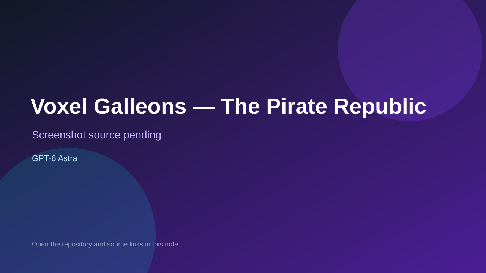

# Voxel Galleons — The Pirate Republic

> Verified game note.

## At a glance

- **Score:** 8.0/10
- **Model:** GPT-6 Astra
- **Technology:** Three.js, JavaScript, WebGL, Browser
- **Estimated FP32 operations/s at 60 FPS:** 1,000,000,000 (low confidence; static estimate, not measured).
- **Rating basis:** Conservative source-scope estimate from documented mechanics and code; not a visual rating or runtime playtest.
- **Verified:** 2026-09-28
- **Repository:** [https://github.com/GraceUnderGravity/VoxelGalleons](https://github.com/GraceUnderGravity/VoxelGalleons)
- **Evidence:** [creator-reported model evidence](https://github.com/GraceUnderGravity/VoxelGalleons)

## Screenshots

No screenshot source is recorded yet. Keep the placeholder until a repository, awesome list, or creator source provides an image.

## Model attribution

Open the evidence link above. Evidence grade: **creator-reported model evidence**.

## Source description

Sail and fire broadside cannons, collect five salvage bundles, sink two navy patrols and return to Nassau; manage hull and cargo. Repository description says "Made with Astra xHigh" without spelling out GPT-6; record creator-reported Astra attribution, not a co-authored commit. Repository creation is not proof of game publication.

### Gameplay source

- [https://github.com/GraceUnderGravity/VoxelGalleons/blob/31d17b32aebb466d38ed8e4c345f90c3e9321eae/dist/game.js](https://github.com/GraceUnderGravity/VoxelGalleons/blob/31d17b32aebb466d38ed8e4c345f90c3e9321eae/dist/game.js)
- [https://github.com/GraceUnderGravity/VoxelGalleons](https://github.com/GraceUnderGravity/VoxelGalleons)

## Verification notes

- **Status:** verified_source
- **Counted units in repository:** 1
- **Units covered by this note:** 1
- **Discovery:** GitHub model/game source search; creation filtered to 2026-09-21..2026-09-28 Asia/Ho_Chi_Minh; https://github.com/GraceUnderGravity/VoxelGalleons

[Back to the awesome list](../../README.md)
