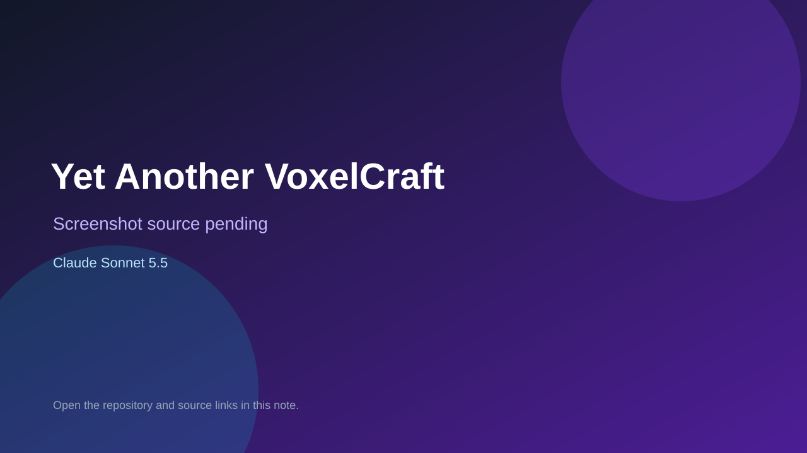

# Yet Another VoxelCraft

> Verified game note.

## At a glance

- **Score:** 8.3/10
- **Model:** Claude Sonnet 5.5
- **Technology:** Three.js, JavaScript, Web Audio
- **Estimated FP32 operations/s at 60 FPS:** 120,000,000 (low confidence; static estimate, not measured).
- **Rating basis:** Estimate source completeness, mechanics, documented run path, tests and attribution; do not treat this as a visual review or runtime benchmark.
- **Verified:** 2026-09-30
- **Repository:** [https://github.com/GoldwinXS/YetAnotherVoxelCraft](https://github.com/GoldwinXS/YetAnotherVoxelCraft)
- **Evidence:** [direct model evidence](https://github.com/GoldwinXS/YetAnotherVoxelCraft/commit/ba792582287ba96a12b0a135df284c569fe5aa7b)
- **Live demo:** [open demo](https://goldwinxs.github.io/YetAnotherVoxelCraft/)

## Screenshots

No screenshot source is recorded yet. Keep the placeholder until a repository, awesome list, or creator source provides an image.

## Model attribution

Open the evidence link above. Evidence grade: **direct model evidence**.

## Source description

Inspect survival health/hunger, mining, crafting, tools, mobs, farming, creative controls and save slots. Inspect the checked-in entry point and gameplay systems. Treat repository creation as a freshness proxy, not proof of game creation or publication. Do not treat this source verification as a runtime playtest.

### Gameplay source

- [https://github.com/GoldwinXS/YetAnotherVoxelCraft/blob/ba792582287ba96a12b0a135df284c569fe5aa7b/index.html](https://github.com/GoldwinXS/YetAnotherVoxelCraft/blob/ba792582287ba96a12b0a135df284c569fe5aa7b/index.html)
- [https://github.com/GoldwinXS/YetAnotherVoxelCraft/commit/ba792582287ba96a12b0a135df284c569fe5aa7b](https://github.com/GoldwinXS/YetAnotherVoxelCraft/commit/ba792582287ba96a12b0a135df284c569fe5aa7b)

## Verification notes

- **Status:** verified_source
- **Counted units in repository:** 1
- **Units covered by this note:** 1
- **Discovery:** GitHub model-and-date repository search; commit-attribution freshness join (September 29–30 UTC+7); https://github.com/GoldwinXS/YetAnotherVoxelCraft

[Back to the awesome list](../../README.md)
