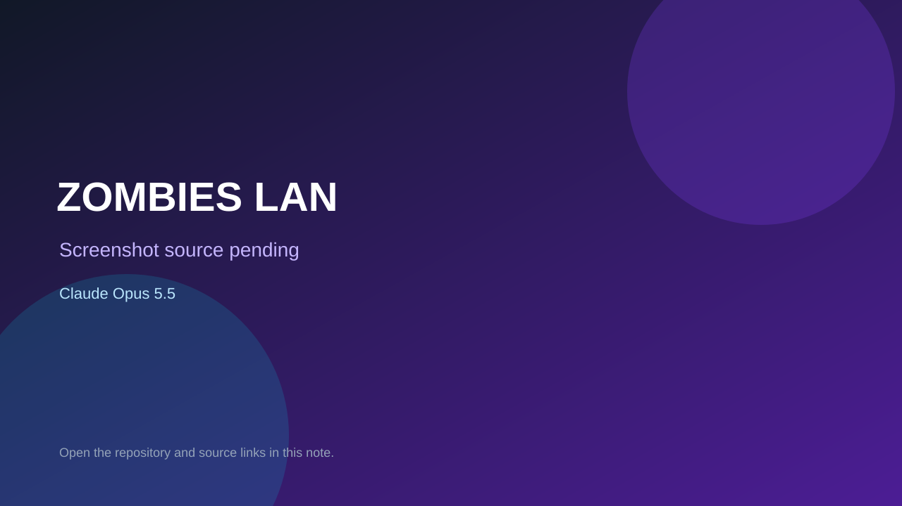

# ZOMBIES LAN

> Verified game note.

## At a glance

- **Score:** 8.0/10
- **Model:** Claude Opus 5.5
- **Technology:** Three.js, JavaScript, WebGL, Browser
- **Estimated FP32 operations/s at 60 FPS:** 1,000,000,000 (low confidence; static estimate, not measured).
- **Rating basis:** Conservative source-scope estimate from implemented controls, rules and state; not a visual rating or runtime playtest.
- **Verified:** 2026-09-27
- **Repository:** [https://github.com/mitotkp/ZOMBIES-LAN](https://github.com/mitotkp/ZOMBIES-LAN)
- **Evidence:** [direct model evidence](https://github.com/mitotkp/ZOMBIES-LAN/commit/0eebee2fd33c162055284fd147a67d16283f90d9)

## Screenshots

No screenshot source is recorded yet. Keep the placeholder until a repository, awesome list, or creator source provides an image.

## Model attribution

Open the evidence link above. Evidence grade: **direct model evidence**.

## Source description

Survive zombie waves with one to four LAN players, earn points, unlock doors, buy weapons and revive teammates; player damage and host-authoritative network state are implemented. Verify source only; do not infer runtime success or publication date from repository creation.

### Gameplay source

- [https://github.com/mitotkp/ZOMBIES-LAN/blob/93e8191e4b23679004895a92cfdd581250b76dd2/public/js/player.js](https://github.com/mitotkp/ZOMBIES-LAN/blob/93e8191e4b23679004895a92cfdd581250b76dd2/public/js/player.js)
- [https://github.com/mitotkp/ZOMBIES-LAN/commit/0eebee2fd33c162055284fd147a67d16283f90d9](https://github.com/mitotkp/ZOMBIES-LAN/commit/0eebee2fd33c162055284fd147a67d16283f90d9)

## Verification notes

- **Status:** verified_source
- **Counted units in repository:** 1
- **Units covered by this note:** 1
- **Discovery:** GitHub repository search: model/game created:2026-09-25..2026-09-27; exact creation timestamp filtered to Asia/Ho_Chi_Minh September 26–27; https://github.com/mitotkp/ZOMBIES-LAN

[Back to the awesome list](../../README.md)
